# HTTP/3 State Machine Results (as of June 2, 2025)

| Server Version | Client-Server Pair | PCAP File | Final State Machine Image |
|----------------|--------------------|-----------|----------------------------|
| caddy_2.4.6 | ch_m_cdy_o | `sample_traffics/ch_m_cdy_o.pcapng` |  |
| caddy_2.4.6 | ch_o_cdy_o | `sample_traffics/ch_o_cdy_o.pcapng` |  |
| caddy_2.4.6 | ff_m_cdy_o | `sample_traffics/ff_m_cdy_o.pcapng` | 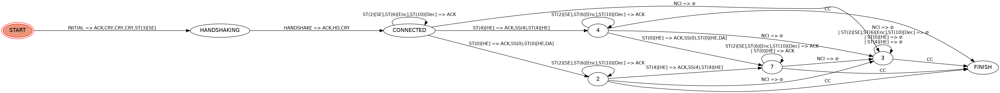 |
| caddy_2.4.6 | ff_o_cdy_o | `sample_traffics/ff_o_cdy_o.pcapng` |  |
| caddy_2.4.6 | op_m_cdy_o | `sample_traffics/op_m_cdy_o.pcapng` | 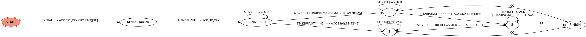 |
| caddy_2.4.6 | op_o_cdy_o | `sample_traffics/op_o_cdy_o.pcapng` |  |
| h2o_16b13ee | ch_m_h2o_m | `sample_traffics/ch_m_h2o_m.pcapng` | 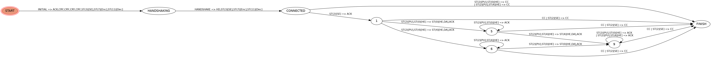 |
| h2o_16b13ee | ch_o_h2o_m | `sample_traffics/ch_o_h2o_m.pcapng` |  |
| h2o_16b13ee | ff_m_h2o_m | `sample_traffics/ff_m_h2o_m.pcapng` |  |
| h2o_16b13ee | ff_o_h2o_m | `sample_traffics/ff_o_h2o_m.pcapng` | 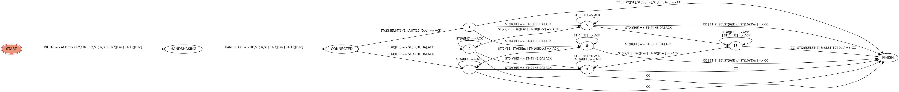 |
| h2o_16b13ee | op_m_h2o_m | `sample_traffics/op_m_h2o_m.pcapng` | 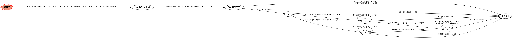 |
| h2o_16b13ee | op_o_h2o_m | `sample_traffics/op_o_h2o_m.pcapng` |  |
| h2o_222b36d | ch_m_h2o_o | `sample_traffics/ch_m_h2o_o.pcapng` |  |
| h2o_222b36d | ch_o_h2o_o | `sample_traffics/ch_o_h2o_o.pcapng` |  |
| h2o_222b36d | ff_m_h2o_o | `sample_traffics/ff_m_h2o_o.pcapng` |  |
| h2o_222b36d | ff_o_h2o_o | `sample_traffics/ff_o_h2o_o.pcapng` |  |
| h2o_222b36d | op_m_h2o_o | `sample_traffics/op_m_h2o_o.pcapng` |  |
| h2o_222b36d | op_o_h2o_o | `sample_traffics/op_o_h2o_o.pcapng` |  |
| nginx_1.25.5 | ch_m_ng_o | `sample_traffics/ch_m_ng_o.pcapng` | 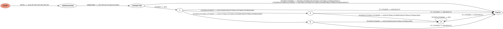 |
| nginx_1.25.5 | ch_o_ng_o | `sample_traffics/ch_o_ng_o.pcapng` |  |
| nginx_1.25.5 | ff_m_ng_o | `sample_traffics/ff_m_ng_o.pcapng` |  |
| nginx_1.25.5 | ff_o_ng_o | `sample_traffics/ff_o_ng_o.pcapng` | 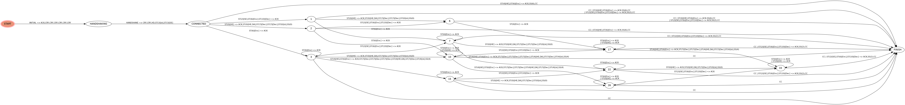 |
| nginx_1.25.5 | op_m_ng_o | `sample_traffics/op_m_ng_o.pcapng` |  |
| nginx_1.25.5 | op_o_ng_o | `sample_traffics/op_o_ng_o.pcapng` |  |
| nginx_1.27.0 | ch_m_ng_m | `sample_traffics/ch_m_ng_m.pcapng` |  |
| nginx_1.27.0 | ch_o_ng_m | `sample_traffics/ch_o_ng_m.pcapng` | 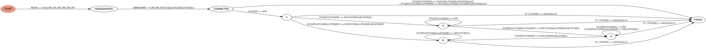 |
| nginx_1.27.0 | ff_m_ng_m | `sample_traffics/ff_m_ng_m.pcapng` | 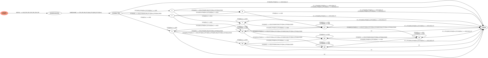 |
| nginx_1.27.0 | ff_o_ng_m | `sample_traffics/ff_o_ng_m.pcapng` |  |
| nginx_1.27.0 | op_m_ng_m | `sample_traffics/op_m_ng_m.pcapng` |  |
| nginx_1.27.0 | op_o_ng_m | `sample_traffics/op_o_ng_m.pcapng` |  |
| openlitespeed_1.7.15 | ch_m_ols_o | `sample_traffics/ch_m_ols_o.pcapng` |  |
| openlitespeed_1.7.15 | ch_o_ols_o | `sample_traffics/ch_o_ols_o.pcapng` |  |
| openlitespeed_1.7.15 | ff_m_ols_o | `sample_traffics/ff_m_ols_o.pcapng` | 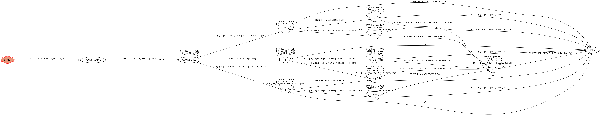 |
| openlitespeed_1.7.15 | ff_o_ols_o | `sample_traffics/ff_o_ols_o.pcapng` |  |
| openlitespeed_1.7.15 | op_m_ols_o | `sample_traffics/op_m_ols_o.pcapng` |  |
| openlitespeed_1.7.15 | op_o_ols_o | `sample_traffics/op_o_ols_o.pcapng` |  |
| openlitespeed_1.8.1 | ch_m_ols_m | `sample_traffics/ch_m_ols_m.pcapng` |  |
| openlitespeed_1.8.1 | ch_o_ols_m | `sample_traffics/ch_o_ols_m.pcapng` |  |
| openlitespeed_1.8.1 | ff_m_ols_m | `sample_traffics/ff_m_ols_m.pcapng` |  |
| openlitespeed_1.8.1 | ff_o_ols_m | `sample_traffics/ff_o_ols_m.pcapng` | 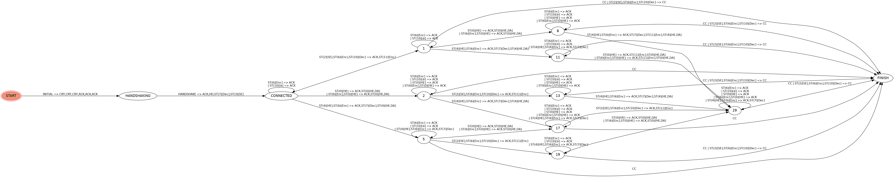 |
| openlitespeed_1.8.1 | op_m_ols_m | `sample_traffics/op_m_ols_m.pcapng` | 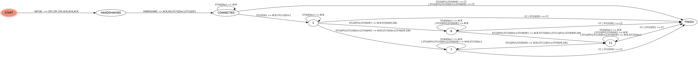 |
| openlitespeed_1.8.1 | op_o_ols_m | `sample_traffics/op_o_ols_m.pcapng` |  |